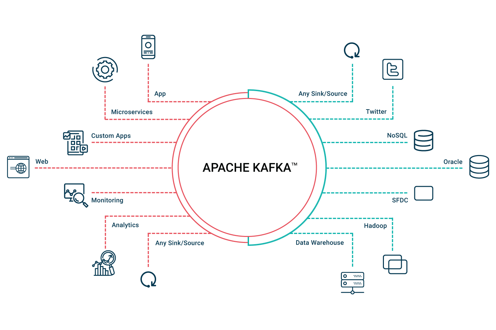

# Kafka
This project describes my personal Kafka Platform Streaming approach through many Programming Languages (e.g Java, NodeJs, Python ecc.).

# Pre-requisites 
Mandatory:
- Docker/VM Installation ([Instructions](#Tips))
- OS Basics (Windows/Linux/Mac)

Optional:

- Docker Basics or VM Basics
  * [Docker Video Tutorial](https://www.youtube.com/watch?v=fqMOX6JJhGo)
- Broker Messaging Basics
  * [Kafka](https://www.youtube.com/watch?v=SqVfCyfCJqw)
  * [RabbitMQ](https://www.youtube.com/watch?v=nFxjaVmFj5E)
  * [ActiveMQ](https://www.youtube.com/watch?v=-zUwkIsY1Bg)
- [Java Basics](https://www.youtube.com/watch?v=grEKMHGYyns&t=4269s)
- Eclipse or Intellij IDE basics
  * Eclipse Download:
  * Intellij Download:
- VS Code Editor basics:
  * Download: 
  * Course:

# Introduction


What is Kafka?
---
Apache Kafka is an **open source** distributed streaming system used for stream processing, real-time data pipelines, and data integration at scale.

- [Video](https://www.youtube.com/watch?v=aj9CDZm0Glc&vl=it)
- [Documentation](https://kafka.apache.org/documentation/)


What is Kafka used for?
---


Here is a description of a few of the popular use cases for Apache Kafka®: [Link](https://kafka.apache.org/uses)

# Getting Started
## Setting Environment
First of all you need to choose the nature of you environment:
- [Docker](###Docker)
- [VM + Local](###VirtualBox)

### Docker
See the pre-requisites for installing docker on your machine depending about your OS System, then:

- Verify that docker is up and running typing in your shell:
```
>> docker --help 
```
- Download docker-compose.yml file and navigate through the folder where is located, then type in shell:
```
>> docker-compose up -d
```
- If everything starts correctly you will find 4 containers:
  * Zookeeper
  * Kafka Cluster:
    + Kafka Broker 1
    + Kafka Broker 2
    + Kafka Broker 3

### VirtualBox
See the pre-requisites for installing VirtualBox on your machine depending about your OS System, then:
- Follow the steps in this video for downloading and setting up a Linux Distribution inside VM: [Link](https://www.youtube.com/watch?v=5sa0acU4pmY&t=15s)
- Download kafka from [local installation instruction](#tips) and try to start it.
## Main Goal
[TODO]
## Choose your preferred programming languages

- [CLI](./CLI/README.md)
- [Java](./Java/README.md)
- [Python](./Python/README.md)
- [NodeJS](./NodeJS/README.md)
# Tips

- [Docker Installation](https://docs.docker.com/get-docker/)
- [VM Installation](https://www.virtualbox.org/wiki/Downloads)
- [Local Installation](https://kafka.apache.org/downloads)
